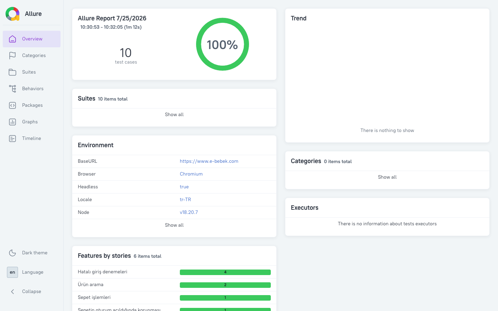
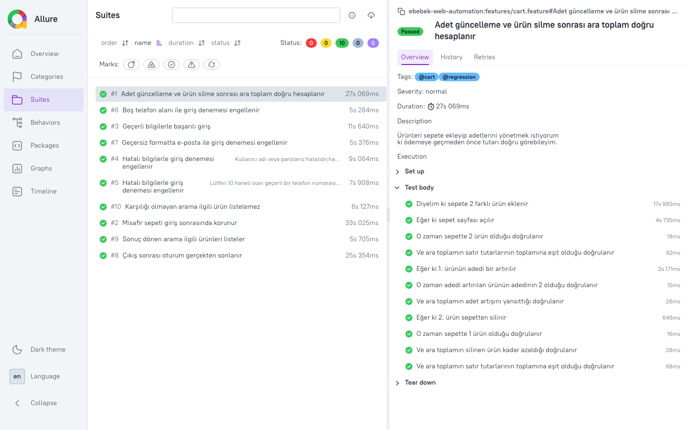

# e-bebek Web Test Otomasyonu

e-bebek (https://www.e-bebek.com) üzerinde uçtan uca web test otomasyonu.
JavaScript + Playwright + Cucumber + Allure, Page Object Pattern ile.

Testler canlı siteye karşı koşar; ayrı bir test ortamı yoktur.

## Gereksinimler

- Node.js 18+
- Allure raporu için Java 8+ (Allure CLI proje bağımlılığı olarak gelir, ayrıca kurulum gerekmez)
- Docker ile koşmak isteyenler için Docker (opsiyonel)

## Kurulum

```bash
npm install
npx playwright install chromium
cp .env.example .env
```

`.env` dosyasına giriş bilgilerini girin:

```
BASE_URL=https://www.e-bebek.com
EBEBEK_PHONE=5xxxxxxxxx      # 10 hane, başında 0 olmadan
EBEBEK_PASSWORD=********
HEADLESS=true
```

Base URL, kullanıcı bilgileri ve zaman aşımları `config/config.js` üzerinden okunur.
Zorunlu bir değişken eksikse koşum, hangi değişkenin eksik olduğunu söyleyerek durur.
`.env` versiyon kontrolüne dahil değildir.

## Çalıştırma

```bash
npm test                    # tüm senaryolar, 2 worker ile paralel
WORKERS=4 npm run test:parallel   # worker sayısını değiştirerek
npx cucumber-js -p serial   # tek process, hata ayıklarken
npm run test:smoke          # @smoke
npm run test:regression     # @regression
npm run test:negative       # @negative
npm run test:unit           # fiyat parse yardımcılarının birim testleri (tarayıcı gerekmez)
```

Tarayıcıyı görerek koşmak için `.env` içinde `HEADLESS=false`.

### Rapor

```bash
npm run report              # allure generate + allure open
```

Raporda Gherkin adımları Allure adımı olarak, ortam bilgisi (`environment.properties`)
ve etiketler yer alır. Hata durumunda ekran görüntüsü ve Playwright trace otomatik
eklenir; trace, Allure'ın trace görüntüleyicisiyle açılır.

Video kaydı isteğe bağlıdır ve maliyeti nedeniyle varsayılan olarak kapalıdır:

```bash
VIDEO=true npm test        # yalnızca başarısız senaryoların kaydı rapora eklenir
VIDEO=all npm test         # her senaryonun kaydı senaryo adıyla saklanır (demo/hata ayıklama)
HEADLESS=false SLOW_MO=250 npx cucumber-js -p serial features/cart.feature   # akışı tarayıcıda izlemek için
```

Kayıtlar `reports/videos/` altına düşer; geçen senaryolarınki koşum sonunda silinir.
Bu klasör versiyon kontrolüne dahil değildir.

10 senaryonun 2 worker ile koştuğu bir raporun genel görünümü:



Senaryo detayında Gherkin adımları, etiketler ve adım süreleri:



### Docker

```bash
docker build -t ebebek-automation .
docker run --rm --env-file .env -v "$PWD/allure-results:/app/allure-results" ebebek-automation
```

İmaj, projedeki Playwright sürümüyle aynı resmi Playwright imajını temel alır
(`mcr.microsoft.com/playwright:v1.61.1-noble`); tarayıcılar hazır gelir.

## Senaryolar

| Dosya | Kapsam | Etiketler |
|---|---|---|
| `features/login.feature` | Geçerli bilgilerle giriş ve hesap menüsündeki kullanıcıya özgü linklerin doğrulanması | `@auth @smoke` |
| `features/login_negative.feature` | Hatalı şifre, eksik haneli telefon (Scenario Outline + Examples), boş alan, kayıtlı olmayan e-posta, geçersiz e-posta formatı | `@auth @negative @regression` |
| `features/search.feature` | Sonuç dönen ve karşılığı olmayan arama | `@search @smoke @regression` |
| `features/cart.feature` | İki ürün ekleme, adet artırma, ürün silme, ara toplamın sayısal doğrulanması | `@cart @regression` |
| `features/cart_persistence.feature` | Misafir sepetinin giriş sonrasında korunması | `@cart @auth @regression` |
| `features/logout.feature` | Çıkış sonrası oturumun gerçekten sonlanması (oturum API üzerinden hazırlanır) | `@auth @regression` |

### Konsol çıktısı

Koşum, her senaryoyu bittiği anda adı, etiketleri ve süresiyle yazar; hata olursa
hangi adımda ne patladığı sonda toplu olarak listelenir:

```
✓ Adet güncelleme ve ürün silme sonrası ara toplam doğru hesaplanır @cart @regression (27.6s)
✓ Hatalı bilgilerle giriş denemesi engellenir → "boş telefon" kullanıcısı ile giriş denenir @auth @negative (8.1s)
✓ Çıkış sonrası oturum gerçekten sonlanır @auth @regression (20.6s)

11 senaryo — 11 senaryonun tamamı geçti
```

Cucumber'ın hazır konsol formatter'ları ya adım başına nokta basıyor ya da
"3/5 steps" ilerleme çubuğu gösteriyor; ikisi de hangi senaryonun koştuğunu
söylemiyor. `reporters/readable-formatter.js` bunun yerine senaryo bazlı yazıyor.
Aynı isimli Scenario Outline satırları ilk adımlarıyla ayırt ediliyor. Renkler
yalnızca gerçek terminalde kullanılıyor, CI logunda kapalı.

## Proje yapısı

```
config/           ortam değişkenleri ve doğrulaması
reporters/        cucumber konsol formatter'ı
fixtures/         test kullanıcıları ve test verisi
pages/            page object'ler + locators.js (tüm selector'lar burada)
utils/            fiyat parse, bekleme ve locator yardımcıları
features/
  *.feature             Türkçe Gherkin senaryoları
  step_definitions/     generic ve alan bazlı step'ler
  support/              World, hooks, element registry
```

### Hazır (generic) step'ler

Senaryoların çoğu tekrar kullanılabilir step'lerle yazıldı:

```gherkin
Diyelim ki "giriş" sayfasına gidilir
Eğer ki "e-posta sekmesi" elementine tıklanır
Ve "e-posta alanı" alanına "gecersiz-eposta" yazılır
O zaman "Geçerli bir e-posta adresi giriniz." metninin görünür olduğu kontrol edilir
```

Feature dosyalarında selector geçmez. Step'lerdeki iş dilindeki element isimleri
(`"e-posta alanı"`, `"hesap menüsü"`) `features/support/element-registry.js`
üzerinden `pages/locators.js` içindeki tanımlara çözülür. Bir selector değiştiğinde
tek dosya güncellenir. Giriş akışı ve sepet matematiği gibi alan bilgisi gerektiren
işler için ayrı step'ler yazıldı.

### Locator stratejisi

Öncelik: anlamlı `id` → rol/metin tabanlı seçim → stabil CSS sınıfı. Site bir SAP
Spartacus (Angular) uygulaması; `id`'ler ve bileşen sınıfları kararlı olduğu için
XPath zincirlerine ihtiyaç olmadı. Örnek: `#txtPhoneNumberMobile`,
`#btnLoginWithEmail`, `.basket-product-item`, `getByRole('button', { name: /giriş yap/i })`.

## Test izolasyonu ve paralel koşum

İzolasyon iki katmanlı:

1. **Process seviyesi** — Cucumber `parallel: 2` ile senaryolar ayrı worker
   process'lerinde koşar (`WORKERS` ile artırılabilir).
2. **Senaryo seviyesi** — Tarayıcı `BeforeAll` ile bir kez açılır, ancak her senaryo
   kendi `BrowserContext`'ini alır (`features/support/world.js`) ve senaryo sonunda
   context kapatılır. Çerez, oturum ve sepet verisi senaryolar arasında taşınmaz.

Senaryolar arasında paylaşılan durum yok; adımlar arası veri (seçilen ürünler,
ölçülen tutarlar) World üzerindeki `this.state` içinde tutulur. Misafir sepeti →
giriş akışı da bu sayede diğer senaryoları etkilemeden koşar.

## Bekleme stratejisi ve çözülen kararsızlıklar

Testlerde sabit bekleme yok; Playwright'ın otomatik beklemesi, `expect(locator)` ve
`expect.poll` tabanlı koşullu beklemeler ile `utils/waits.js` içindeki yardımcılar
kullanılıyor.

Koşumlarda karşılaşılan kararsızlıklar ve çözümleri:

**1. Maskeli telefon alanında karışan haneler.**
Giriş formundaki telefon alanı maskeli. Rakamları tek tek yazan yaklaşım
(`pressSequentially`) maskenin imleç konumlandırmasıyla yarıştı; paralel koşumda
haneler yer değiştirdi (örneğin `5551234567` yerine `5551234657`) ve giriş
başarısız oldu. Çözüm: değeri tek işlemde yazmak (`fill`) ve tıklamadan önce
değerin forma işlendiğini `expect.poll` ile doğrulamak (`pages/LoginPage.js`).

**2. Sepete ekleme sessizce başarısız olabiliyor.**
"Sepete Ekle" butonu, Angular olay dinleyicisini bağlamadan çok önce görünür
oluyor. Üstelik `disable` sınıfını hiç bırakmıyor, Playwright'ın "enabled"
kontrolü de bunu görmüyor: erken tıklama hiçbir şey yapmıyor, hata da vermiyor.
Sonuç birkaç adım sonra "sepet boş" olarak ortaya çıkıyordu. Çözüm: sitenin kendi
onay penceresini eklemenin kanıtı saymak ve gelmezse tıklamayı tekrarlamak
(`pages/ProductPage.js`).

**3. Adet artışında sunucu onayının beklenmemesi.**
Sepette adet metni iyimser güncelleniyor: istek sunucuya ulaşmasa bile satır "2"
gösteriyor, tutarlar ise hâlâ tek ürünü anlatıyor. Adet metnini kanıt saymak,
ara toplamın 20 saniye boyunca eski değerde kaldığı bir hataya yol açtı. Çözüm:
beklemeyi adetten, sunucunun onayladığı özet değişimine taşımak
(`pages/CartPage.js`). Ara toplam okumaları ayrıca beklenen değere ulaşana kadar
yeniden okunuyor ve zaman aşımında son okunan değer hata mesajına yazılıyor.

**4. Assertion ve aksiyon zaman aşımlarının farklı olması.**
Tarayıcı context'i 20 sn'lik aksiyon zaman aşımıyla kuruluyor, ancak Playwright'ın
`expect` varsayılanı 5 sn. Sunucudan dönen bir geçişi (giriş sonrası açılan kayıt
formu gibi) doğrulayan adımlar, sayfa hâlâ çalışırken aralıklı olarak düşüyordu.
Çözüm: `utils/expect.js` içinde aksiyonlarla aynı süreyi kullanan ortak bir
`expect` tanımlamak.

**5. Arama sonuçlarının yönlendirme sırasında okunması.**
Sonuç dönen bir arama, ilgili kategori sayfasına yönlendiriliyor ve yönlendirme
tamamlanana kadar ekranda hâlâ ayrılmakta olan sayfanın ürünleri duruyor. Listeyi
tek seferde okumak, bu ara durumda ilgisiz ürünleri yakalayıp senaryoyu hatalı
yere kırıyordu. Çözüm: ilişki oranını hedef sayfa yerine oturana kadar yeniden
okumak (`features/step_definitions/search.steps.js`). Karşılığı olmayan arama
senaryosunda ise tersi geçerli: geçici bir ara durum "ilişkisiz" sanılmasın diye
liste sabitlendikten sonra tek okuma yapılıyor.

**6. Tıklamayı engelleyen overlay'ler.**
Çerez banner'ı sayfaya gecikmeli düşüyor, sepete ekleme sonrası sağdan açılan modal
tıklamaları engelliyor (`ngb-modal-window intercepts pointer events`). Çözüm:
`utils/waits.js` içindeki `dismissIfVisible` — element kısa sürede görünürse
kapatılıyor, görünmezse beklenmeden devam ediliyor. Banner'ın kendiliğinden
kapanma ihtimaline karşı tıklama da best-effort. Sepetten ürün silme ayrı bir
onay modalı açtığı için silme akışı bu onayı da kapsıyor (`pages/CartPage.js`).

## Sepet toplamı doğrulaması

Fiyatlar `1.299,90 TL` biçiminde geliyor; `utils/price.js` içindeki `parsePrice`
binlik ayracını ve para birimini temizleyip sayıya çeviriyor. Doğrulama metin
karşılaştırması ile değil sayısal olarak, üç bağımsız kontrolle yapılıyor:

1. Ara toplam, satır tutarlarının toplamına eşit mi?
2. Adet bir artırıldığında ara toplam tam olarak birim fiyat kadar arttı mı?
3. Bir ürün silindiğinde ara toplam o satırın tutarı kadar azaldı mı?

Sepet satırlarında fiyat iki biçimde görünüyor: indirimli üründe `.old-price`
(liste fiyatı üzerinden satır tutarı) ve `.product-price-discount`, indirimsiz
üründe `.product-price`. "Ürünler Toplamı" liste fiyatları üzerinden hesaplandığı
için doğrulamada satır başına liste tutarı kullanılıyor.

Fiyat metninin ayrıştırılması `utils/price.test.js` içindeki birim testlerle
korunuyor (`npm run test:unit`): özet satırı tek parça metin olarak okunduğu için,
etikette geçen bir sayının ("... (2 Ürün)") fiyat sanılması mümkündü.

Kampanyalar ve fiyatlar canlı ortamda değiştiği için sabit tutar beklentisi yerine
göreli (delta) doğrulama tercih edildi: hesaplama hatası yakalanır, fiyat değişimi
testi kırmaz.

## API ile oturum hazırlama

Çıkış senaryosunda test edilen şey çıkışın kendisi; giriş yalnızca bir ön koşul.
Bu yüzden iki adımlı giriş formu sürülmüyor: token doğrudan storefront'un OAuth
uç noktasından alınıp (`utils/api-auth.js`) Spartacus'un oturumu sakladığı
`localStorage` anahtarına yazılıyor, ardından sayfa yenileniyor.

Enjeksiyon bilinçli olarak tek seferlik: `addInitScript` ile yapılsaydı token her
navigasyonda geri yazılır ve çıkış sonrası misafir durumu hiç doğrulanamazdı.

Kullanılan `client_id`/`client_secret` storefront'un herkese açık değerleri —
her tarayıcı isteğinde görünüyorlar, kullanıcı sırrı değiller. Hesap bilgileri
yine `.env` üzerinden geliyor. API adresi `API_URL` ile yapılandırılır.

## Test verisi

Sepete eklenecek ürünler koşum anında kategori listesinden seçilir; sabit ürün kodu
(SKU) tutulmaz, böylece bir ürün stoktan kalktığında senaryo kırılmaz. Arama
terimleri ve negatif giriş kombinasyonları `fixtures/` altında, kullanıcı bilgileri
`.env` içinde.

## Siteye özgü davranışlar

Senaryolar sitenin gerçek davranışı incelenerek tasarlandı. Tasarımı etkileyen
noktalar:

- **Giriş, e-posta/şifre değil telefon + şifre ile iki adımlı ilerliyor.** Telefon
  doğrulandıktan sonra aynı ekranda şifre alanı açılıyor.
- **Kayıtlı olmayan e-posta hata mesajı üretmiyor;** site doğrudan kayıt formunu
  açıyor. İlgili negatif senaryo bu gerçek davranışı doğruluyor: kayıt formu
  görünür oluyor ve kullanıcı misafir olarak kalıyor.
- **Arama hiçbir zaman boş sonuç döndürmüyor.** Anlamsız bir terimde bile
  ("qxzjvbkwmfpldnhtsr") site "665 Adet ürün bulundu" diyerek ilgisiz ürünler
  listeliyor; "sonuç bulunamadı" gibi bir mesaj yok. Bu nedenle "sonuç dönmeyen
  arama" senaryosu, dönen sonuçların hiçbirinin arama terimiyle ilişkili olmadığını
  doğruluyor. Sonuç dönen aramada ise başlıkların en az %70'inin terimle ilişkili
  olması bekleniyor.
- **Hatalı şifre denemeleri sayılıyor** ("Kalan deneme hakkınız: 4"). Hesabın
  kilitlenmemesi için negatif senaryolarda gerçek hesaba tek bir hatalı deneme
  gönderiliyor; diğer negatif durumlar hesaba dokunmadan test ediliyor.
- **Oturum doğrulaması hesap menüsü üzerinden yapılıyor.** Menü hover ile açılan bir
  flyout olduğu için linkler DOM'da olsa da görünür değil; senaryo önce menüyü açıyor,
  sonra görünürlüğü doğruluyor. Çıkış senaryosu ayrıca oturum gerektiren bir sayfaya
  erişimin `/login`'e yönlendirildiğini kontrol ediyor.
